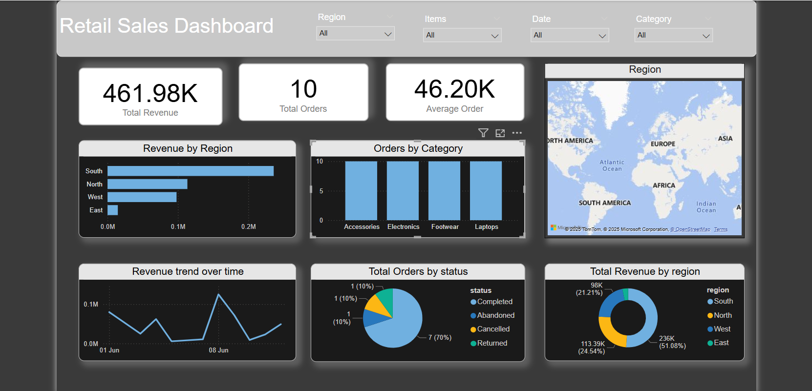
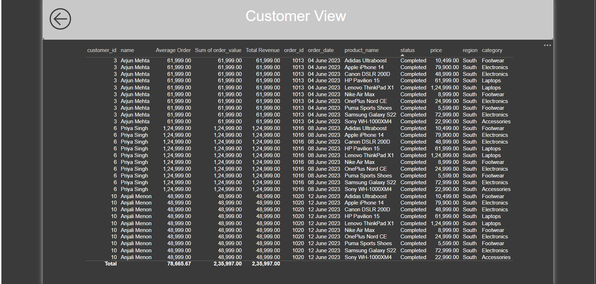

# Retail-Sales-Analytics-Pipeline
=====================================

---

## Tools & Technologies

- **MySQL Workbench** – Database schema and data
- **Python (pandas, mysql-connector)** – ETL pipeline
- **Excel** – Final cleaned export
- **Power BI** – Dashboard visualization

---

##  Data Flow

1. **MySQL**: All sales, customers, and product data stored in normalized tables.
2. **Python (Jupyter)**: Connects to MySQL, runs JOIN queries, performs cleaning, exports to Excel.
3. **Power BI**: Imports Excel to build dashboards with filters, DAX measures, and drill-through capabilities.

---

##  Dashboards

###  Retail Sales Dashboard
- Total Revenue, Orders, and Average Order Value
- Revenue by Region
- Orders by Category
- Revenue Trend Over Time
- Orders by Status

###  Drill-Through: Customer View
- Customer-wise breakdown
- Product-level details
- Purchase dates and order values

---

##  How to Run

1. **MySQL**  
   - Run `databaseCreate.sql` and import all `*.sql` files inside `/data`.

2. **Python**
   - Open `extract_clean_export.ipynb`
   - Run cells to extract from MySQL → clean → export to Excel

3. **Power BI**
   - Open `.pbix` file from `/powerbi`
   - Refresh data or customize filters and drill-through

---

##  Screenshots

| Retail Dashboard | Customer View |
|------------------|----------------|
|  |  |

---

##  Features

-  Clean and well-structured SQL schema
-  End-to-end ETL pipeline using Python
-  Power BI dashboard with DAX and drill-through
-  Modular folder structure for real-world use

---

## Author

**Abhishek Supakar**  
mail: supakarabhishek@gmail.com  
link: [LinkedIn](https://www.linkedin.com/in/abhisheksupakar)

---

##  License

MIT License — feel free to use and modify.
